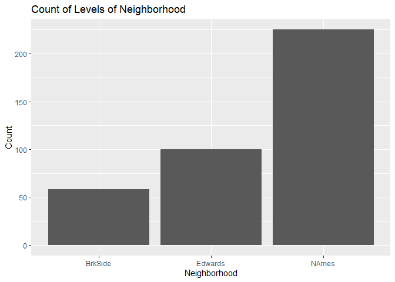
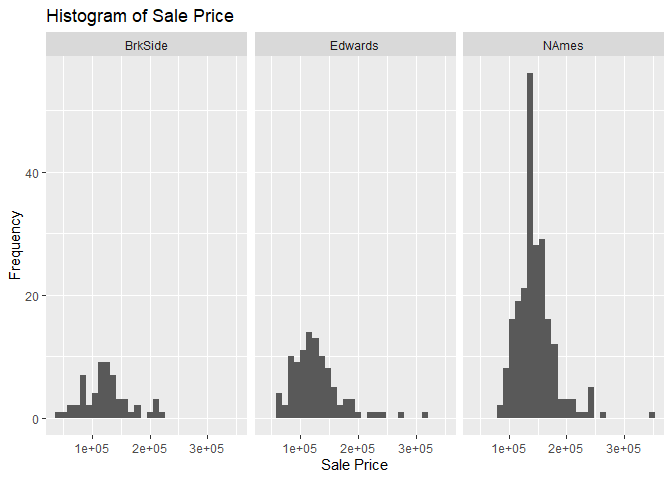
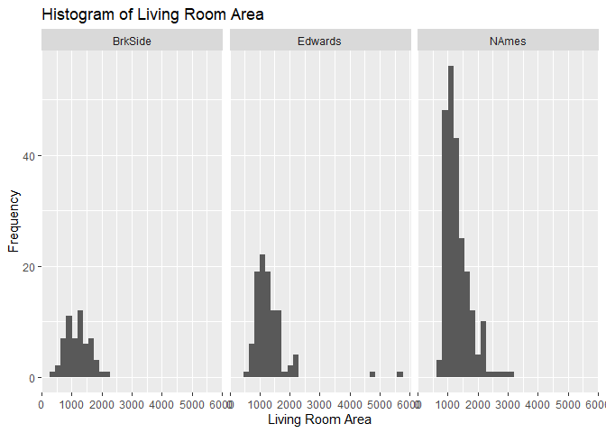
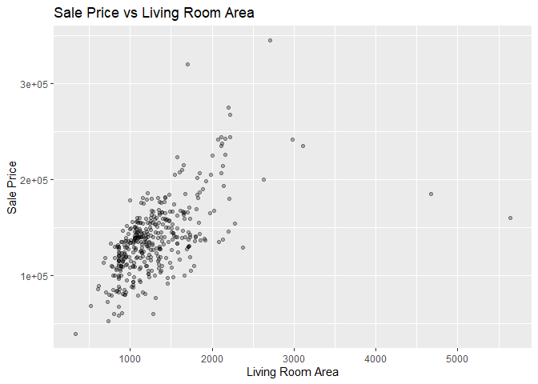
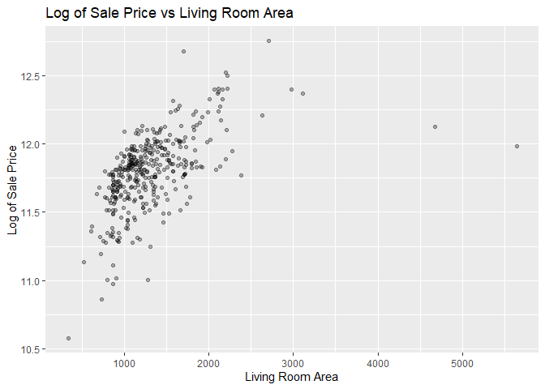
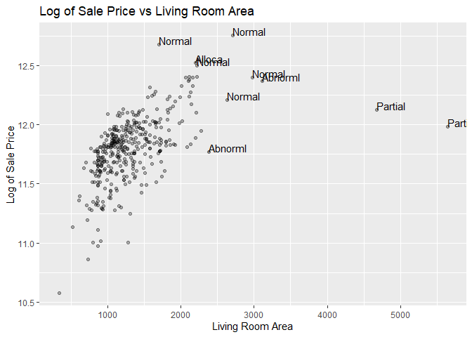
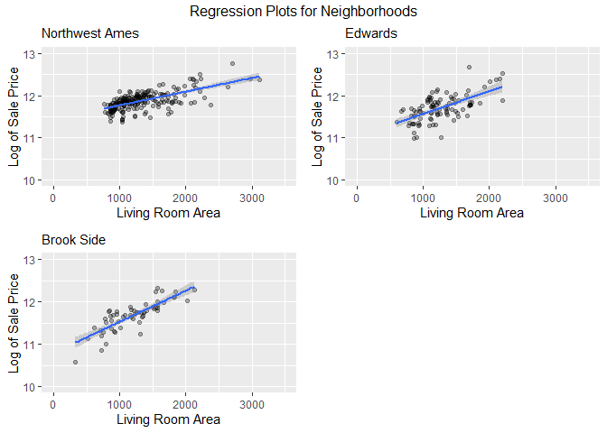
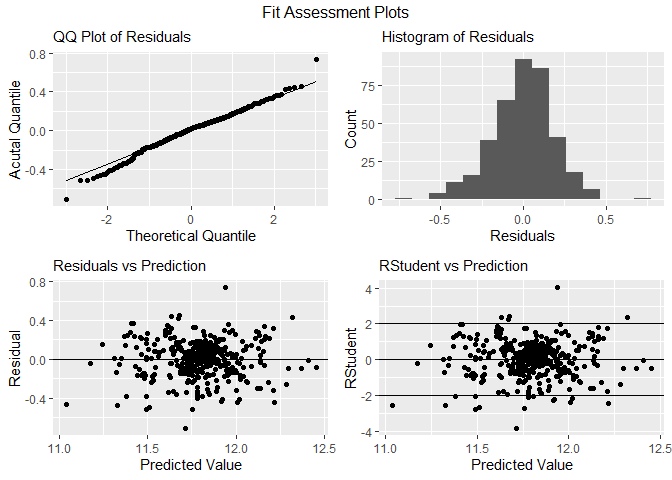
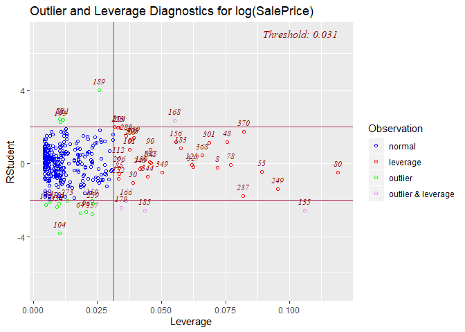
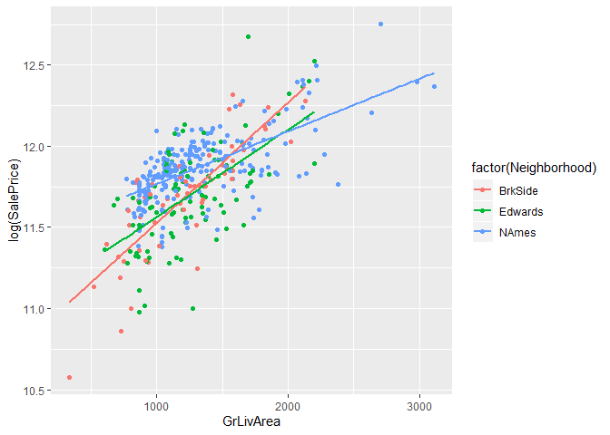

Question 1
================
Stuart Miller
August 2, 2019

  - [Requested Analysis](#requested-analysis)
  - [Analysis](#analysis)
      - [Extract Data of Interest](#extract-data-of-interest)
      - [Plots of Data](#plots-of-data)
      - [Model](#model)
          - [Interaction Terms](#interaction-terms)
          - [Parameter Estimation](#parameter-estimation)
          - [Model Accuracy Estimation](#model-accuracy-estimation)
      - [Model Assumptions Assessment](#model-assumptions-assessment)
      - [Conclusion](#conclusion)
          - [Interpretation](#interpretation)
          - [Linear Regression Lines for all three neighborhoods (Log
            Scale of Sale
            Price)](#linear-regression-lines-for-all-three-neighborhoods-log-scale-of-sale-price)

# Requested Analysis

Century 21 Ames wants to understand if there is a relationship between
the square footage of the living areas of houses (`GrLivArea`) and sale
price in the neighborhood where they operate Northwest Ames, Edwards,
and Brookside (`NAmes`, `Edwards` and `BrkSide`).

# Analysis

## Extract Data of Interest

``` r
# select data of interest
train <- train %>% 
  filter(Neighborhood %in% c("Edwards", "BrkSide", "NAmes"))
train$Neighborhood <- as.factor(train$Neighborhood)
```

## Plots of Data

Barplot of count houses in `Neighborhood`s of interest.

``` r
train %>% ggplot(aes(x = Neighborhood)) + geom_bar() + 
  labs(title = 'Count of Levels of Neighborhood', 
       y = 'Count')
```

<!-- -->

Histogram of `SalePrice`, which is the sale price of the houses in the
dataset.

``` r
train %>% ggplot(aes(x = SalePrice)) +
  geom_histogram() + 
  facet_grid(. ~ Neighborhood) +
  labs(title = 'Histogram of Sale Price', 
       y = 'Frequency', x = 'Sale Price')
```

<!-- -->

Histogram of `GrLivArea`, which is the square footage of the living
areas of houses in the dataset.

``` r
train %>% ggplot(aes(x = GrLivArea)) +
  geom_histogram() + 
  facet_grid(. ~ Neighborhood) +
  labs(title = 'Histogram of Living Room Area', 
       y = 'Frequency', x = 'Living Room Area')
```

<!-- -->

Scatter plot of `SalePrice` vs `GrLivArea` shows that the large values
in `GrLivArea` are pulling the regression line. A log transfrom on
`SalePrice` may help correct this.

``` r
train %>% ggplot(aes(x = GrLivArea, y = SalePrice)) +
  geom_point(alpha = 0.3) +
  labs(title = 'Sale Price vs Living Room Area', 
       y = 'Sale Price', x = 'Living Room Area')
```

<!-- -->

Scatter plot of the log transform of `SalePrice` vs `GrLivArea` shows
taking the log transform of `GrLivArea` does improve the linear
relationship. It seem reasible that the relationship could be linear,
excluding the two anomalous points on the right of the graph. These
points will need some investigation.

``` r
train %>% ggplot(aes(x = (GrLivArea), y = log(SalePrice))) +
  geom_point(alpha = 0.3) +
  labs(title = 'Log of Sale Price vs Living Room Area', 
       y = 'Log of Sale Price', x = 'Living Room Area')
```

<!-- -->

Add labels of `SaleCondition` of the two points of interest and some
neighboring points to the scatter plot the log transform of `SalePrice`
vs the log transform of `GrLivArea`. This indicates the influential
points are of type `Partial` `SaleCondition`, which means the houses
were not completed at the time of assessment. This could mean the assess
prices are not correct. These points will be excluded from the analysis
becasue they may not be correct.

``` r
train %>% ggplot(aes(x = (GrLivArea), y = log(SalePrice))) +
  geom_point(alpha = 0.3) +
  labs(title = 'Log of Sale Price vs Living Room Area', 
       y = 'Log of Sale Price', x = 'Living Room Area') +
  geom_text(aes(label = ifelse((log(GrLivArea) > 7.75 & log(SalePrice) > 11) |
                                 (log(SalePrice) > 12.45),
                               SaleCondition, '')), hjust=0, vjust=0)
```

<!-- -->

Scatter plot log of sale price vs living room area for each neighborhood
with the suspect points excluded. In each case, there is not sigificant
evidence against the assumption of linearity.

``` r
regplot.names <- train %>% filter(Neighborhood == 'NAmes') %>%
  ggplot(aes(x = (GrLivArea), y = log(SalePrice))) +
  geom_point(alpha = 0.3) +
  ylim(10, 13) +
  xlim(0, 3500) +
  geom_smooth(method = 'lm') +
  labs(subtitle = 'Northwest Ames', 
       y = 'Log of Sale Price', x = 'Living Room Area')

regplot.ed <- train %>%
  filter(GrLivArea < 4000) %>%
  filter(Neighborhood == 'Edwards') %>%
  ggplot(aes(x = (GrLivArea), y = log(SalePrice))) +
  geom_point(alpha = 0.3) +
  ylim(10, 13) +
  xlim(0, 3500) +
  geom_smooth(method = 'lm') +
  labs(subtitle = 'Edwards', 
       y = 'Log of Sale Price', x = 'Living Room Area')

regplot.brk <- train %>% filter(Neighborhood == 'BrkSide') %>%
  ggplot(aes(x = (GrLivArea), y = log(SalePrice))) +
  geom_point(alpha = 0.3) +
  ylim(10, 13) +
  xlim(0, 3500) +
  geom_smooth(method = 'lm') +
  labs(subtitle = 'Brook Side', 
       y = 'Log of Sale Price', x = 'Living Room Area')
grid.arrange(regplot.names,regplot.ed,regplot.brk, nrow = 2,
             top = 'Regression Plots for Neighborhoods')
```

<!-- -->

## Model

Based on the linear-log plot above, the response will be modeled as


where Edwards neighborhood is used for reference.

### Interaction Terms

We will use an extra sums of square test to verify that the interaction
terms are useful for the model. The ESS test provides convincing
evidence that the interaction terms are useful (p-value \< 0.0001);
thus, we will continue with the full model.

``` r
# create dummy variables with Neighborhood == 'Edwards' as reference
train <- get.dummies(train, "Neighborhood", reference = 'Edwards')
```

    ## [1] "Neighborhood_BrkSide"
    ## [1] "Neighborhood_NAmes"

``` r
# remove suspect points from training data
train.mod <- train %>% filter(GrLivArea < 4000)

# full model formula
model.formula = log(SalePrice) ~ (GrLivArea) + 
     Neighborhood_BrkSide + 
     Neighborhood_NAmes +
     (GrLivArea) * Neighborhood_BrkSide + 
     (GrLivArea) * Neighborhood_NAmes
# reduced model formula
model.reduced.formula = log(SalePrice) ~ (GrLivArea) + 
     Neighborhood_BrkSide + 
     Neighborhood_NAmes

# fit models
model <- lm(formula = model.formula, data = train.mod)
model.reduced <- lm(formula = model.reduced.formula, data = train.mod)
# ESS test on models
anova(model.reduced, model)
```

    ## Analysis of Variance Table
    ## 
    ## Model 1: log(SalePrice) ~ (GrLivArea) + Neighborhood_BrkSide + Neighborhood_NAmes
    ## Model 2: log(SalePrice) ~ (GrLivArea) + Neighborhood_BrkSide + Neighborhood_NAmes + 
    ##     (GrLivArea) * Neighborhood_BrkSide + (GrLivArea) * Neighborhood_NAmes
    ##   Res.Df    RSS Df Sum of Sq      F    Pr(>F)    
    ## 1    377 14.824                                  
    ## 2    375 13.441  2    1.3834 19.299 1.053e-08 ***
    ## ---
    ## Signif. codes:  0 '***' 0.001 '**' 0.01 '*' 0.05 '.' 0.1 ' ' 1

### Parameter Estimation

Estimate parameters in the model by fitting to the entire dataset to the
chosen model.

``` r
# formula for model
model.formula = log(SalePrice) ~ (GrLivArea) + 
     Neighborhood_BrkSide + 
     Neighborhood_NAmes +
     (GrLivArea) * Neighborhood_BrkSide + 
     (GrLivArea) * Neighborhood_NAmes

# model the mean response given equation above
model <- lm(formula = model.formula, data = train.mod)
summary(model)
```

    ## 
    ## Call:
    ## lm(formula = model.formula, data = train.mod)
    ## 
    ## Residuals:
    ##      Min       1Q   Median       3Q      Max 
    ## -0.71071 -0.11467  0.02085  0.11453  0.73596 
    ## 
    ## Coefficients:
    ##                                  Estimate Std. Error t value Pr(>|t|)    
    ## (Intercept)                     1.103e+01  7.084e-02 155.633  < 2e-16 ***
    ## GrLivArea                       5.387e-04  5.405e-05   9.966  < 2e-16 ***
    ## Neighborhood_BrkSide           -2.339e-01  1.083e-01  -2.160 0.031409 *  
    ## Neighborhood_NAmes              4.179e-01  8.237e-02   5.073 6.17e-07 ***
    ## GrLivArea:Neighborhood_BrkSide  1.996e-04  8.443e-05   2.364 0.018598 *  
    ## GrLivArea:Neighborhood_NAmes   -2.145e-04  6.210e-05  -3.454 0.000615 ***
    ## ---
    ## Signif. codes:  0 '***' 0.001 '**' 0.01 '*' 0.05 '.' 0.1 ' ' 1
    ## 
    ## Residual standard error: 0.1893 on 375 degrees of freedom
    ## Multiple R-squared:  0.5271, Adjusted R-squared:  0.5208 
    ## F-statistic: 83.61 on 5 and 375 DF,  p-value: < 2.2e-16

``` r
confint(model)
```

    ##                                        2.5 %        97.5 %
    ## (Intercept)                     1.088619e+01  1.116478e+01
    ## GrLivArea                       4.323815e-04  6.449277e-04
    ## Neighborhood_BrkSide           -4.468114e-01 -2.096977e-02
    ## Neighborhood_NAmes              2.558923e-01  5.798200e-01
    ## GrLivArea:Neighborhood_BrkSide  3.355877e-05  3.655777e-04
    ## GrLivArea:Neighborhood_NAmes   -3.366455e-04 -9.241461e-05

``` r
# get CI for Northwest Ames
confint(glht(model, linfct = "GrLivArea + GrLivArea:Neighborhood_NAmes = 1"))
```

    ## 
    ##   Simultaneous Confidence Intervals
    ## 
    ## Fit: lm(formula = model.formula, data = train.mod)
    ## 
    ## Quantile = 1.9663
    ## 95% family-wise confidence level
    ##  
    ## 
    ## Linear Hypotheses:
    ##                                               Estimate  lwr      
    ## GrLivArea + GrLivArea:Neighborhood_NAmes == 1 0.0003241 0.0002640
    ##                                               upr      
    ## GrLivArea + GrLivArea:Neighborhood_NAmes == 1 0.0003843

``` r
# get CI for Brookside
confint(glht(model, linfct = "GrLivArea + GrLivArea:Neighborhood_BrkSide = 1"))
```

    ## 
    ##   Simultaneous Confidence Intervals
    ## 
    ## Fit: lm(formula = model.formula, data = train.mod)
    ## 
    ## Quantile = 1.9663
    ## 95% family-wise confidence level
    ##  
    ## 
    ## Linear Hypotheses:
    ##                                                 Estimate  lwr      
    ## GrLivArea + GrLivArea:Neighborhood_BrkSide == 1 0.0007382 0.0006107
    ##                                                 upr      
    ## GrLivArea + GrLivArea:Neighborhood_BrkSide == 1 0.0008658

### Model Accuracy Estimation

Use 10-fold cross validation to estimate the accuracy metrics of the
model.

``` r
# Set up repeated k-fold cross-validation
train.control <- trainControl(method = "cv", number = 10)
# Train the model
model.cv <- train(model.formula, 
                    data = train.mod,
                    method = 'lm',
                    trControl = train.control)
# print model summary
model.cv
```

    ## Linear Regression 
    ## 
    ## 381 samples
    ##   3 predictor
    ## 
    ## No pre-processing
    ## Resampling: Cross-Validated (10 fold) 
    ## Summary of sample sizes: 342, 342, 343, 342, 344, 343, ... 
    ## Resampling results:
    ## 
    ##   RMSE       Rsquared   MAE      
    ##   0.1906429  0.5321848  0.1476922
    ## 
    ## Tuning parameter 'intercept' was held constant at a value of TRUE

``` r
# get the CV results
res <- model.cv$results

# get cross-validated PRESS statistic
PCV <- PRESS.cv(model.cv)

# print accuracy metrics to md table
kable(data.frame('RMSE'=res$RMSE,
           'CV Press'=PCV,
           'Adjused R Squared'=res$Rsquared))
```

|      RMSE | CV.Press | Adjused.R.Squared |
| --------: | -------: | ----------------: |
| 0.1906429 |  12.4626 |         0.5321848 |

## Model Assumptions Assessment

  - **Linearity**: It appear reasonable that the log of sale price and
    the log of living room area could be linearly related based on a
    scatter plot.
  - **Normality**: The residuals from the model fit appear to be
    normally distributed based on a histogram and qq plot.
  - **Constant Variance**: There is no discernable pattern from a
    scatter plot of residuals and studentized residuals plotted vs
    predicted value.
  - **Independence**: It is not clear how the data was sampled. We will
    assume this is true and
continue.

<!-- end list -->

``` r
basic.fit.plots(train.mod, model)
```

<!-- -->

``` r
ols_plot_resid_lev(model)
```

<!-- -->

``` r
#ols_plot_cooksd_bar(model)
```

## Conclusion

### Interpretation

We estimate that for increase in 100 sq. ft., there is associated
multiplicative increase in median price

  - 1.055 for the Edwards neighborhood with a 95% confidence interval of
    \[1.044 , 1.066\]
  - 1.033 for the Northwest Ames neighorhood with a 95% confidence
    interval of \[1.026 , 1.040\]
  - 1.077 for the Brookside neighorhood with a 95% confidence interval
    of \[1.063 , 1.090\]

Since the sampling procedure is not known and this is an observational
study, the results only apply to this data.

#### Edwards

• each additional 100 sq. ft. of the living area added to a property in
the Edwards neighborhood, holding all other variables constant, would
result in a 5.53% multiplicative increase in the median sales price.
With a 95% confidence interval between \[4.42, 6.66\] percent.

``` r
edwards_estimate <- (exp(5.387e-04 * 100) - 1) * 100
edwards_estimate
```

    ## [1] 5.53474

``` r
edwards_low <- (exp(4.323815e-04 * 100) - 1) * 100
edwards_low
```

    ## [1] 4.418654

``` r
edwards_high <- (exp(6.449277e-04 * 100) - 1) * 100
edwards_high
```

    ## [1] 6.661787

#### Brookside

• each additional 100 sq. ft. of the living area added to a property in
the Brookside neighborhood, holding all other variables constant, would
result in a 7.66% increase in the median sales price. With a 95%
confidence interval of betwee \[6.30, 9.04\] percent.

``` r
brkside_estimate <- (exp(0.0007382 * 100) - 1) * 100
brkside_estimate
```

    ## [1] 7.6613

``` r
brkside_low <- (exp(0.0006107 * 100) - 1) * 100
brkside_low
```

    ## [1] 6.297332

``` r
brkside_high <- (exp(0.0008658 * 100) - 1) * 100
brkside_high
```

    ## [1] 9.04386

#### Northwest Ames

• each additional 100 sq. ft. of the living area added to a property in
the Northwest Ames neighborhood, holding all other variables constant,
would result in a 3.29% increase in the median sales price. With a 95%
confidence interval of betwee \[2.68, 3.92\] percent.

``` r
names_estimate = (exp((0.0003241) * 100) - 1) * 100
names_estimate
```

    ## [1] 3.294092

``` r
names_lower = (exp((0.0002640) * 100) - 1) * 100
names_lower
```

    ## [1] 2.675157

``` r
names_upper = (exp((0.0003843) * 100) - 1) * 100
names_upper
```

    ## [1] 3.917798

``` r
# exp(0.0003241)
# exp(0.0002640)
# exp(0.0003843)

# my.pred <- predict(model, data.frame(Neighborhood = 'Names', GrLivArea = 1500))
# my.pred.exp <- exp(my.pred)
# my.pred.exp
```

### Linear Regression Lines for all three neighborhoods (Log Scale of Sale Price)

``` r
ggplot(train.mod,aes(y=log(SalePrice),x=GrLivArea,color=factor(Neighborhood)))+geom_point()+stat_smooth(method="lm",se=FALSE)
```

<!-- -->
